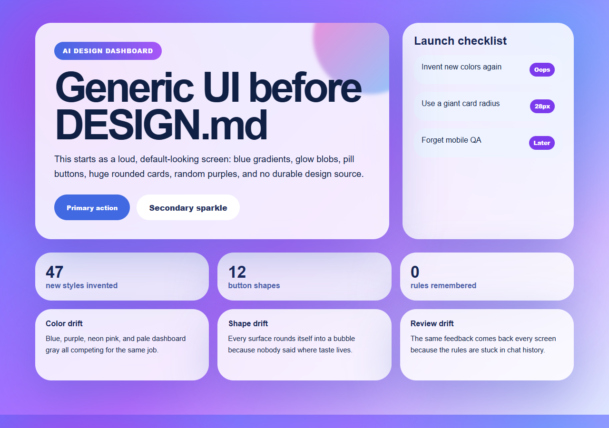
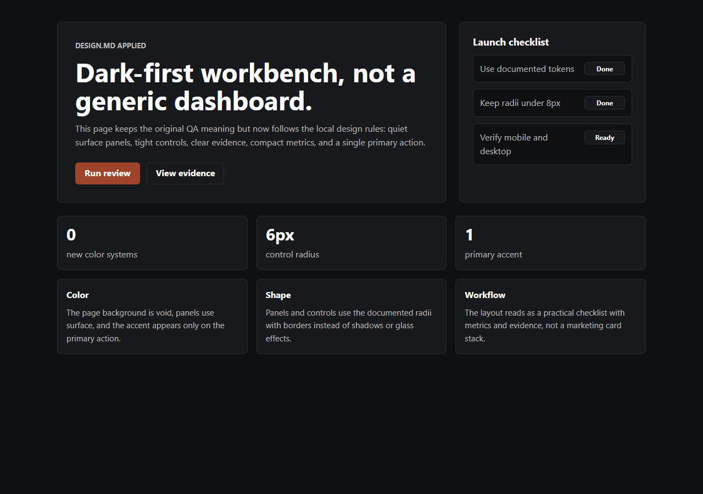

# design-md-for-codex

Give Codex taste. Make it use it.

This is a tiny Codex skill that makes the agent read `DESIGN.md` before it touches UI. Use it when you are done repeating the same color, spacing, typography, component, and "make it less generic" feedback.

## Start

Paste this into Codex:

```text
Use $skill-installer to install https://github.com/danieloleary/design-md-for-codex/tree/main/skills/design-system
```

Then do the obvious three:

1. Restart Codex.
2. Add `DESIGN.md` at the root of your repo.
3. Ask Codex to build, review, or refactor UI.

Example prompt:

```text
$design-system Make this page follow DESIGN.md.
```

## Why DESIGN.md Works

`DESIGN.md` puts product taste where agents can find it. Colors. Type. Spacing. Components. Accessibility. Voice. No-go zones. Write it once. Let every UI pass start there.

## What The Skill Does

The `design-system` skill makes Codex:

1. Find the repo's `DESIGN.md`.
2. Treat it as the source of truth.
3. Use documented colors, type, spacing, components, motion, and accessibility rules.
4. Stop inventing a new visual system when the repo already has one.
5. Check rendered UI on desktop and mobile when frontend code changes.
6. Say which design file it read and what rules it applied.

## What Ships

```text
skills/design-system/
  SKILL.md
  agents/openai.yaml
  references/
    DESIGN.md
    theme.css
    tokens.json
```

The bundled `DESIGN.md` is a starter, not a law. Dan's default taste is dark-first and high-signal: monochrome command surfaces, warm editorial support surfaces, one terracotta accent, clean borders, no generic UI soup.

Replace it with your taste.

## Prove It

1. Copy the install prompt.
2. Restart Codex.
3. Add `DESIGN.md` to a repo.
4. Run:
   ```text
   $design-system Make this page follow DESIGN.md.
   ```
5. Confirm Codex read or applied `DESIGN.md` by checking its response, diff, or rendered UI.

Run the local smoke test:

```powershell
.\qa\smoke-test.ps1
```

Prerequisites: PowerShell, Python, Node/npm with `npx`, network access, and recent Codex system skills.

## Actual Codex Run

I ran the published skill against a deliberately loud `qa/fixture` in a throwaway copy.





Artifacts:

- `qa/fixture/index.html`: reusable bad starting point with generic SaaS soup.
- `qa/fixture/after.html`: output from the Codex proof run.
- `qa/fixture/codex-result.md`: final Codex response from the run.

## Staying Current

Codex moves fast. This repo checks itself every day:

```powershell
.\qa\ci-check.ps1
```

It verifies the public install path, GitHub Pages links, DESIGN.md linting with the latest validator, token parsing, required files, and common encoding problems. See `MAINTAINING.md`.

## Repo-Local Install

Drop the skill into a project:

```text
.agents/
  skills/
    design-system/
      SKILL.md
      agents/openai.yaml
      references/
        DESIGN.md
```

Then put your project `DESIGN.md` at the repo root.

## Customize

- `DESIGN.md`: your real design rules.
- `SKILL.md`: the workflow Codex should follow.
- `agents/openai.yaml`: display metadata.
- `theme.css` and `tokens.json`: optional starter tokens.

## Why Dan Made It

Codex is better when it acts like it has been paying attention.

This is a small habit for keeping taste from disappearing between prompts. Fork it. Tune it. Make it yours.
