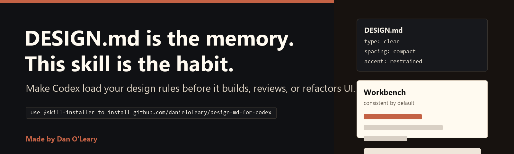

# design-md-for-codex



Make Codex remember your taste.

Made by Dan O'Leary for friends, builders, and people tired of generic AI UI.

This is a tiny Codex skill that makes the agent read `DESIGN.md` before it touches UI. `DESIGN.md` is the memory. This skill is the habit.

Watch the demo: [GitHub Pages showcase](https://danieloleary.github.io/design-md-for-codex/) or [direct MP4](https://danieloleary.github.io/design-md-for-codex/assets/demo-video.mp4).

This repo dogfoods the idea: root [`DESIGN.md`](DESIGN.md) guides the showcase, while [`skills/design-system/references/DESIGN.md`](skills/design-system/references/DESIGN.md) is the reusable starter shipped inside the skill.

## Start

Paste this into Codex:

```text
Use $skill-installer to install https://github.com/danieloleary/design-md-for-codex/tree/main/skills/design-system
```

Then:

1. Restart Codex.
2. Add `DESIGN.md` at the root of your repo.
3. Ask Codex to build, review, or refactor UI.

Example prompt:

```text
$design-system Make this page follow DESIGN.md.
```

## Why DESIGN.md Works

Prompts disappear. Rules remain. Codex knows where to look.

`DESIGN.md` puts product taste where agents can find it: colors, type, spacing, components, accessibility, voice, and no-go zones. Write it once. Let every UI pass start there.

## What The Skill Does

The `design-system` skill makes Codex:

1. Find the repo's `DESIGN.md`.
2. Treat it as the source of truth.
3. Use documented colors, type, spacing, components, motion, and accessibility rules.
4. Stop inventing a new visual system when the repo already has one.
5. Check rendered UI on desktop and mobile when frontend code changes.
6. Say which design file it read and what rules it applied.

## What Ships

```text
skills/design-system/
  SKILL.md
  agents/openai.yaml
  references/
    DESIGN.md
    theme.css
    tokens.json
```

The bundled `DESIGN.md` is a starter, not a law. Dan's default taste is dark-first and high-signal: monochrome command surfaces, warm editorial support surfaces, one terracotta accent, clean borders, no generic UI soup.

Replace it with your taste.

## Demo And Proof

Before: Papyrus soup. After: governed workbench.


Demo video: [assets/demo-video.mp4](assets/demo-video.mp4)

Artifacts:

- `qa/fixture/index.html`: reusable bad starting point with Papyrus, generic soup, and drift.
- `qa/fixture/after.html`: output from the Codex proof run with generated workbench imagery.
- `qa/fixture/codex-result.md`: final Codex response from the run.

Run the local smoke test:

```powershell
.\qa\smoke-test.ps1
```

Verify the saved before/after proof:

```powershell
npm run fixture-qa
```

Prerequisites: PowerShell, Python, Node/npm with `npx`, network access, and the bundled Codex `skill-installer` and `skill-creator` helpers.

Run browser QA when the landing page, copy button, or images change:

```powershell
npm install
npm run visual-qa
```

Screenshots and metrics are written to `output/browser-qa/`.

## Staying Current

Codex moves fast. This repo checks itself every day:

```powershell
.\qa\ci-check.ps1
```

It verifies the public install path, GitHub Pages links, DESIGN.md linting with the latest validator, token parsing, required files, generated assets, and common encoding problems. See `MAINTAINING.md` and `MAINTENANCE-CHECKLIST.md`.

If something feels off, start with `TROUBLESHOOTING.md` or `FAQ.md`.

## Share It

Launch assets and ready-to-post copy live in `LAUNCH.md`. Distribution targets and follow-up catalog paths live in `SHARE.md`. A simple launch tracker lives in `LAUNCH-TRACKER.md`.

The primary install path is this GitHub skill folder. Plugin packaging and an `openai/skills` catalog contribution are future distribution steps.

GitHub issue templates are included for install bugs, skill behavior bugs, docs fixes, and example requests.

## Customize

- `DESIGN.md`: your real design rules.
- `SKILL.md`: the workflow Codex should follow.
- `agents/openai.yaml`: display metadata.
- `theme.css` and `tokens.json`: optional starter tokens.

## Why Dan Made It

Codex is better when it acts like it has been paying attention.

This is a small habit for keeping taste from disappearing between prompts. Fork it. Tune it. Make it yours.
